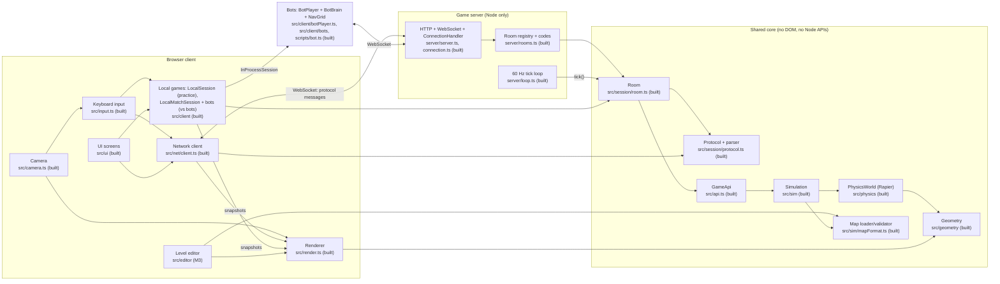
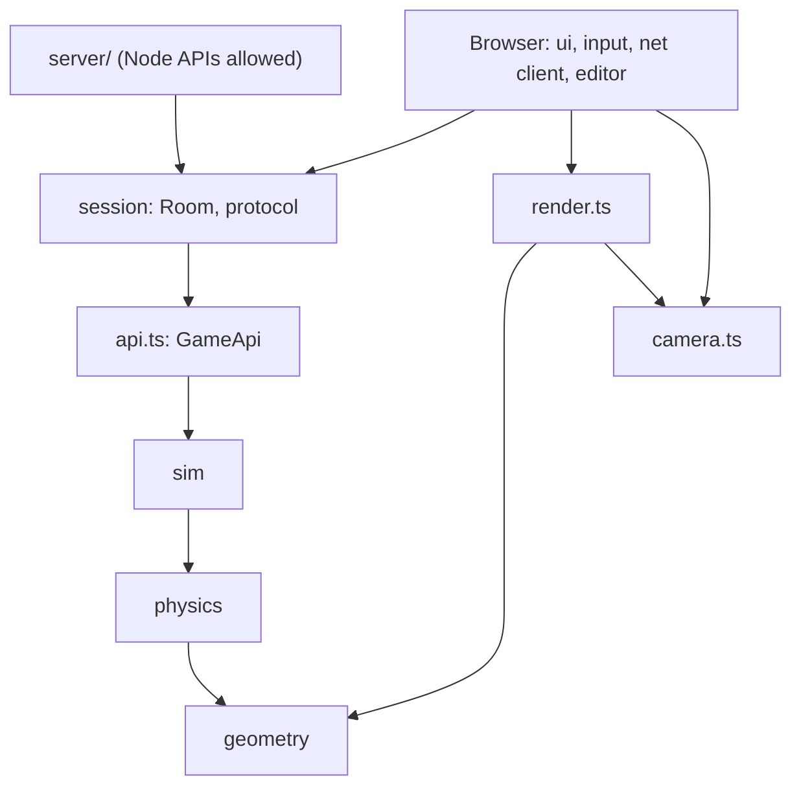
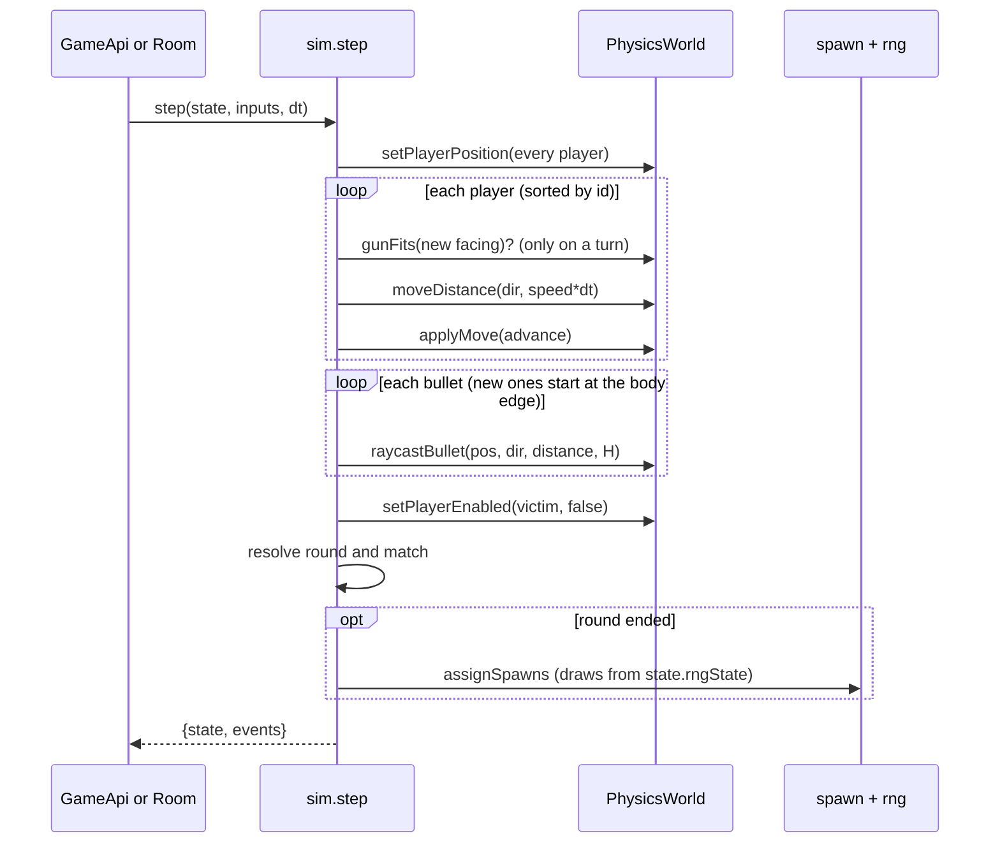
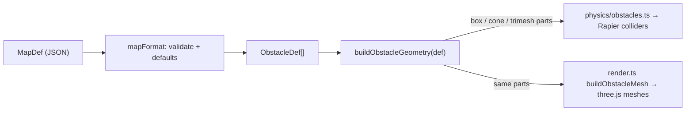
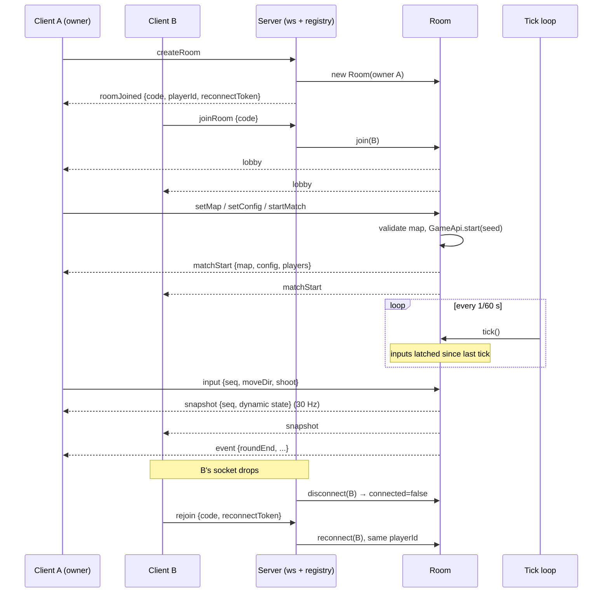
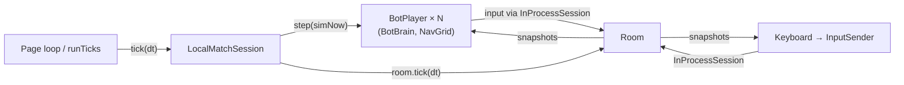

# Browser Party Shooter — Architecture Overview

Date: 2026-09-29

A high-level map of the components and how they interact. The detailed rules live in the
design spec (`spec/2026-09-15-browser-party-shooter-design.md`, cited as §N below); the build
order lives in `spec/2026-09-29-v1-milestones.md`. When this document and the design spec
disagree, the design spec wins. Fix whichever one is wrong.

**Status legend:** **built** exists today · **M0 … M4** the milestone that adds it.

## 1. System overview

Three deployable pieces share one environment-free core:

- **Browser client:** UI, input, rendering, the network client, and the local games (practice, play vs bots).
- **Game server:** a thin Node shell that runs rooms. It is authoritative (§4).
- **Shared core:** the simulation, physics, geometry and the session/room model. It runs unchanged in the browser, on the server and in tests.

## 2. Components

| Component | Responsibility | Key files | Status |
|---|---|---|---|
| **Geometry** | The single conversion from an obstacle's authoring params, and from the player config, to 3D parts (box, cone, cylinder, trimesh; players convex only). Both physics and rendering consume this output, so what you see is what collides (§7, §11). | `src/geometry/obstacleGeometry.ts`, `donutMesh.ts`, `playerGeometry.ts` | built |
| **PhysicsWorld** | A Rapier world used purely for collision queries: obstacle colliders built once per game, one kinematic body per player. Answers `moveDistance` (shape-cast sweep), `gunFits` (overlap), `raycastBullet`, `isFreeOfObstacles`. The one live, non-serializable part of `State`. | `src/physics/world.ts`, `obstacles.ts`, `rapier.ts` | built |
| **Simulation (`sim`)** | Game rules. `createGame(RAPIER, config, map, roster, seed)` and `step(state, inputs, dt) → {state, events}`: movement, turning, shooting, deaths, rounds, match, spawns. Deterministic given the seed (§4). | `src/sim/{state,step,spawn,rng,types,snapshot}.ts` | built |
| **Map loader** | The one entry point for every map (built-in, preset, import, received by the server): version check, defaults, hard constraints. | `src/sim/mapFormat.ts` | built |
| **GameApi** | A control surface over one game: roster, `start({seed})`, `setMoveDir` / `pressShoot`, `tick` / `runTicks`, `getState` / `getEvents`, `pause` / `resume`. A Room and AI harnesses call the same methods. Exposed as `window.GameAPI` during a local game (practice or vs bots). | `src/api.ts` | built |
| **Room** | The session: lobby (roster, owner, unique skins, ready, map, config, start gate), match lifecycle, input latching, disconnect/reconnect, ownership transfer. Emits protocol messages. Time is injected; it never owns a timer. | `src/session/room.ts`, `protocol.ts`, `maps.ts` | built |
| **Game server** | Node shell: WebSocket connections (per-socket size, rate and failed-join limits; connection and room caps; heartbeat), room codes, one drift-corrected 60 Hz loop for all rooms, empty-room cleanup. The only place Node APIs are allowed. | `server/*` | built |
| **Network client** | A `Session` over WebSocket: connects, sends `createRoom`/`joinRoom`/`rejoin` and client messages, delivers server messages, reports the close. Stale-snapshot discard lives in the client model; interpolation between the last two snapshots is applied before rendering. | `src/net/client.ts`, `src/client/interpolate.ts` | built |
| **Renderer** | three.js scene as a pure function of a `RenderState`. Fixed tilted camera, framing computed from board size; obstacle meshes from Geometry. (The HUD is a DOM overlay, see UI screens.) | `src/render.ts` | built |
| **Camera + Input** | Camera azimuth is the source of truth. Arrow and IJKL key mappings are derived from it (§8), then turned into `{moveDir, shoot}`. | `src/camera.ts`, `src/input.ts` | built |
| **Client model** | Pure fold of server messages into the ClientView (screens, lobby, match, snapshots, result), the HUD model, the `InputSender`, the `Session` interface, `LocalSession` (practice) and `LocalMatchSession` (play vs bots), and the simple chase-and-shoot strategy. DOM-free, so it is unit-tested. | `src/client/*` | built |
| **UI screens** | Home → Practice / Play vs bots (setup) / Create / Join / Editor → Lobby → Match → Match end (Play again for vs bots), drawn from the ClientView. Names only ever inserted as text. | `src/ui/*` | built |
| **Level editor** | `EditorApi` (headless) plus a 2D surface and a live 3D preview; validation, presets, JSON import/export. | `src/editor/*` | M3 |
| **Bot client** | `BotPlayer` plays through any Session with the UI's view model and InputSender. In a match its `BotBrain` decides: perception from the snapshot only, `NavGrid` A* paths, utility-scored dodge / evade / attack / chase / wander, and Easy / Normal / Hard profiles (`src/client/bots`). `InProcessSession` attaches it to an in-memory Room; `NetSession` to the real server. `npm run bot` is the CLI. | `src/client/botPlayer.ts`, `src/client/inProcessSession.ts`, `scripts/bot.ts` | built |

## 3. Dependency rules

The arrows point from dependent to dependency. Nothing points upward.

- `geometry`, `physics`, `sim`, `api` and `session` are **environment-free**: no DOM, no Node APIs, no timers they own, no `Math.random` in game state (§4).
- Only `server/` may use Node APIs, and it never imports browser code. This is enforced by its own tsconfig with no `dom` lib (§4 isolation rule). Moving the server to another host is a config change (`VITE_SERVER_URL`), not a code change.
- The renderer and the physics world both depend on `geometry`, and never on each other. That shared dependency is what guarantees render/collision agreement.

## 4. Key interactions

### 4.1 One simulation tick (`step`)

State outside physics is copied per tick. The physics world is shared and mutated in place, which is why each replay needs a fresh game (§15).

### 4.2 Map load: one geometry, two consumers

The donut's trimesh collider and its render mesh use the same vertex and index buffers. `obstacleMesh.test.ts` checks that the render side matches the shared spec.

### 4.3 Multiplayer session (M1 + M2)

When the owner leaves, the owner role passes to the next connected player (`ownerChanged`) and the match continues (§14).

### 4.4 Practice (M1)

A `Room` runs inside the page, driven by the page's own `requestAnimationFrame` fixed-timestep loop. Its snapshots go straight to the renderer. There is no server and no network. The rules, lobby model and messages are the same as in multiplayer.

### 4.4b Play vs bots (M2.5)

`LocalMatchSession` runs a normal (non-practice) `Room` in the page: the human is the owner, and 1–7 `BotPlayer`s join through their own `InProcessSession`s at one difficulty. The page loop calls its `tick()`, which steps the bots on simulated time and then ticks the room, so a seeded match is reproducible under the page loop, `runTicks` or a test. It starts by itself once the bots are ready; after a match, only `playAgain()` starts another.

### 4.5 Three ways to drive the game headlessly (AI and tests)

| Path | Scope | Speed | Status |
|---|---|---|---|
| `GameApi.runTicks(n)` | One game, rules only | Far faster than real time; deterministic with a seed | built |
| `Room` with sink callbacks | Lobby, match, multiple clients, disconnects | Fast, no sockets | built |
| `BotPlayer` + `InProcessSession` (or a `LocalMatchSession`) | Many bots in one in-memory Room, ticked by hand | Far faster than real time; deterministic with a seed | built |
| `scripts/bot.ts` over WebSocket | The real server end to end | Real time | built |

In the page, `window.GameClient` is the UI-level harness: ClientMessages in, the ClientView out, `startLocalMatch(...)` / `playAgain()`, and in local games `pause()`/`runTicks(n)` so the page loop and the harness don't both advance the same state (§4).

## 5. State and data ownership

- **Authoritative state:** `State` inside one `GameApi`, owned by one `Room`. On the server in multiplayer; in the page in local games (practice, vs bots).
- **`State.physics`:** a live handle, never serialized. `toSnapshot()` strips it.
- **Network data:**
  - `matchStart` carries the static map and config once.
  - Snapshots carry only dynamic state: players, bullets, scores, phase, round and time.
  - Clients never send state, only input.
- **Reproducibility:** `State.seed` plus the input sequence fully determine a run.
- **Persistent client data (M3):** map presets in `localStorage`. The server stores nothing; it has no database.

## 6. Deployment

| | Local development (M2 onward) | Production (M4) |
|---|---|---|
| Client | Vite dev server `:5173` | Static build, served by the same app as the server |
| Server | `npm run dev` also starts `server/` on `:8787` (`tsx watch`) | One Fly.io app: static client + WebSocket |
| Client → server | `VITE_SERVER_URL=ws://localhost:8787` (default) | `VITE_SERVER_URL=wss://<app host>` |

## 7. Cross-cutting invariants

These are the rules that have regressed before (details in `CLAUDE.md` and the §N references):

1. **What you see is what's solid.** Render and collision come from one geometry function (§7, §11).
2. **One source of truth for values that must agree.** For example, the camera azimuth drives the key mapping (§8).
3. **Determinism.** No game state depends on `Math.random`, and the seed is recorded (§4).
4. **API-first.** Every UI action is available headlessly through `GameApi`, the `Room`, or the editor API.
5. **Server isolation.** The shared core is environment-free, and Node APIs appear only in `server/` (§4).
